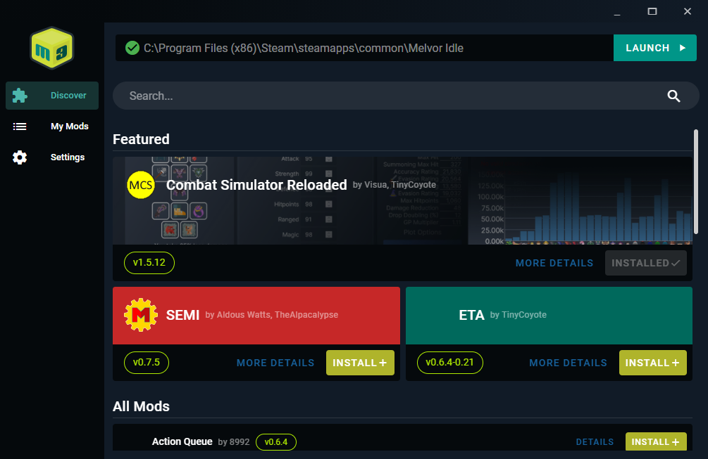
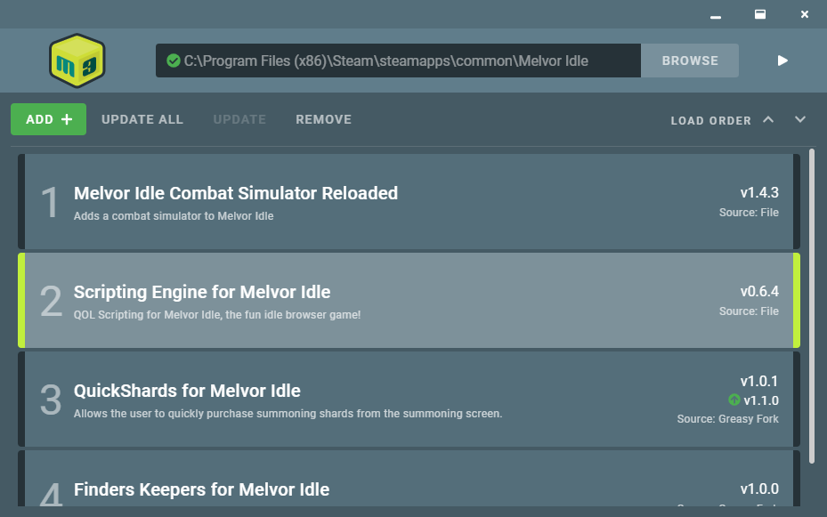

# Melvor Mod Manager (M3)
Melvor Mod Manager (M3) allows you to quickly add userscripts and browser extensions as mods to the Steam edition of Melvor Idle.

## Installation
Download and run the setup .exe from the [Latest Release](https://github.com/ChaseStrackbein/melvor-mod-manager/releases/latest). You will likely receive a warning that the publisher is unknown - I do not have a code signing certificate so make sure you only download [releases from GitHub](https://github.com/ChaseStrackbein/melvor-mod-manager/releases) or [compile the code yourself](https://github.com/ChaseStrackbein/melvor-mod-manager/#steps-for-compiling-m3-yourself).

## Use
**!!! Only add scripts or extensions that you trust !!!**

**And as always, backing up your save(s) is a good idea before using any new tool or mod.**

Once installed and launched:
1. Click the 'Browse' button and find your Melvor Idle installation directory. It is most likely something like: `C:\Program Files (x86)\Steam\steamapps\common\Melvor Idle`
    * *Note: On MacOS, you may need to make sure your Library directory is visible in the Finder.*
2. Add popular mods from the curated **Discover** tab. Simply find the mod you want and click **Install**!
3. Alternatively, you can click the **Add +** button and manually add a mod from either a file or a web URL.
4. Launch the game using the button in the upper-right and your mods should be loaded upon selecting your character.

### Add from Discover Tab
Mods can be added from the Discover tab. This is a curated list of popular mods that have generally been tested by the community. Still, I cannot guarantee them to be working or not including malicious code - I'll do my best to inspect the code and test them, I urge you to use the **Info** button to guage the mod for yourself.

### Add From File
Files can be either a JavaScript (.js) file formatted with UserScript metadata or a WebExtension manifest (manifest.json). This means that for extensions, you should manually download them (for example, from the Combat Simulator Reloaded's [release page](https://github.com/visua0/Melvor-Idle-Combat-Simulator-Reloaded/releases)), extract the .zip file, and then navigate the M3 file prompt to the manifest.json file found within.

### Add From Web
Currently only GreasyFork userscript URLs are supported. Example: `https://greasyfork.org/en/scripts/428146-quickshards-for-melvor-idle`

### Updating Mods
M3 currently only supports updating of mods through the UI that have been added via the Discover tab or GreasyFork. For all other mods, you should first remove it and then re-add using the newer version. 

### Mod Load Order
You can adjust the load order of the mods using the arrows on the right-hand side of the mod list. This may help in resolving dependencies in the correct order.

## Screenshots

## Steps for Compiling M3 Yourself
For now, in order to use M3 on MacOS or Linux, you must build the application yourself. You may also choose to do this on Windows.
1. Download and install [Node.js](https://nodejs.org/en/)
2. Download the M3 source code from the [latest release](https://github.com/CherryMace/melvor-mod-manager/releases/latest) and unzip it.
3. Open the directory in your choice of terminal/command prompt.
4. Install dependencies using `npm install`. This may take several minutes.
5. Package into an executable using `npm run electron:build`.
6. The resulting application that may be installed should be available within `dist_electron`.

## License
MIT

## Submitting Feedback or Contributing
Feel free to [create an issue here on GitHub](https://github.com/ChaseStrackbein/melvor-mod-manager/issues) or reach out to me on Discord @ Buttchouda#3950.

To develop locally, ensure you have [Node.js](https://nodejs.org/en/) installed, install dependencies using `npm install`, and start a dev instance using `npm run electron:serve`.